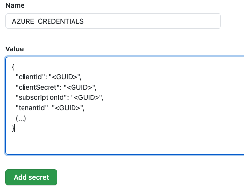

# Challenge_04 Create a GitHub Workflow to deploy an ARM Template

In this challenge, we create a GitHub workflow to deploy the ARM template we created in the previous challenge.
A GitHub Workflow is an automated pipeline to build and deploy artifacts like an Azure ARM Template. A workflow is like an orchestration of multiple jobs and steps to build and deploy artifacts. It is is kicked off by a trigger. A GitHub Workflow supports different trigger types, but in this challenge we trigger the workflow maually.
[Here](https://docs.github.com/en/actions/reference/events-that-trigger-workflows) you can find a description of all supported trigger types.
The [workflow_dispatch](https://docs.github.com/en/actions/reference/events-that-trigger-workflows#workflow_dispatch) trigger allows us to trigger a workflow manually.


## Grant a GitHub Workflow access to your Azure Subscription

To grant a GitHub workflow access to your Azure subscription, we need to create an Azure AD service principal and assign it the desired rights to the subscription. After creating the service principal and assigning the permissions, we need to pass the service principal to GitHub so the workflow can access it. GitHub provides a secret store, to save sensitive informations in your organization, repository or repository environment. When a workflow is executed these secrets are injected as encrypted environment variables and accessible in the workflow definition.

To create a service principal and assign the needed rights we use the Azure CLI and the **ad sp create-for-rbac** command. Open a shell and replace the needed values marked with <>:

```Shell
az ad sp create-for-rbac --name "<sp name>" --role contributor --scopes /subscriptions/<subscription id> --sdk-auth  
```

> **_Hint:_** if you don't know your subscription id use the **account show** command:
> ```
> az account show
> ```

Copy the JSON output object for your service principal:

```JSON
{
  "clientId": "<GUID>",
  "clientSecret": "<GUID>",
  "subscriptionId": "<GUID>",
  "tenantId": "<GUID>",
  (...)
}
```

Open your GitHub repository 'iac-basics-workshop' an go to **Settings**.


Select Secrets and then **New repository secrets**.


Paste in your JSON object for your service principal with the name AZURE_CREDENTIALS.




## Create a Workflow that logs on to Azure

Now we create our first workflow to check if the workflow can authenticate.
Workflows are stored in **.github/workflows** of your repository's root directory.

Create a workflow file unter **.github/workflows** and name it **authenticate-test.yml**.

### Options for triggering a workflow 

There are several options for triggering a workflow. To get a full list of all available trigger have a look at [Events that trigger workflows](https://docs.github.com/en/actions/reference/events-that-trigger-workflows) at GitHub documentation.

We use the **worklow_dispatch** trigger in our example to be able to trigger a workflow manually. To use this trigger your workflow trigger will look like this:

```yaml
name: Autehticate Azure Test
on:
  workflow_dispatch:
```

### GitHub Actions

The [GitHub Marketplace](https://github.com/marketplace?type=actions&query=azure) has several actions that help you automate Azure related tasks.
As we want to login to Azure we use the [azure/login@v1](https://github.com/Azure/login) GitHub Action and pass the **AZURE_CREDENTIALS** secret to authenticate using the previous created service principal:

``` yaml
jobs:
  login-azure:
    steps:
      - name: "Login via Azure CLI"
        uses: azure/ligin@v1
          with:
            creds: ${{ secrets.AZURE_CREDENTIALS }}
```

To see if the workflow is authenticated and uses the right subscription, we can run command-line programs using the operatings system's shell:

```yaml
steps:
...
  - name: Show Azure Account
    run: az account show
```

### Add the workflow file to your remote repository

Your workflow file **.github/workflows/authenticate-test.yml should now look like this:

```yaml
name: Autehticate Azure Test

on:
  workflow_dispatch:

jobs:
  login-azure:
    runs-on: ubuntu-latest
    steps:
      - name: "Login via Azure CLI"
        uses: azure/ligin@v1
        with:
          creds: ${{ secrets.AZURE_CREDENTIALS }}
      - name: Show Azure Account
        run: az account show
```

Save the file, add, commit and push the changes:

```Shell
git add .
git commit -m "added auth test workflow "
git push
```


